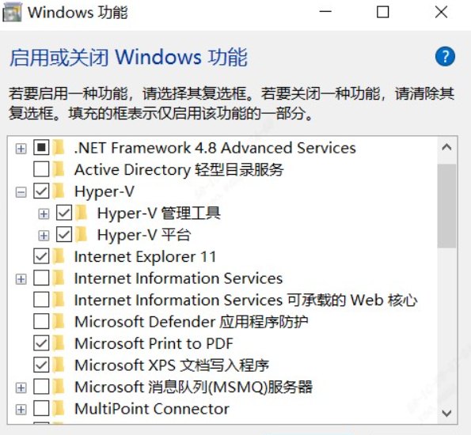

### 镜像烧录
- 准备
    - 小白需要准备一下[github加速](https://blog.csdn.net/B11050729/article/details/132131659)
    - 请仔细阅读官方文档，并准备好microSD卡用于烧录、Type-C线用于供电与连接以及Duo开发板,现在[milkv Duo启动](https://github.com/network201/linux-lab.git)
- 镜像烧录工具
    - [Rufus(推荐)](https://rufus.ie/en/)
    - [balenaEtcher](https://etcher.balena.io/)
- Milk-V
    - [官方SDK文档](https://github.com/milkv-duo/duo-buildroot-sdk)((学有余力的同学可以看看，不影响烧录))
    - [镜像下载](https://github.com/milkv-duo/duo-buildroot-sdk/releases/download/Duo-V1.0.5/milkv-duo-v1.0.5-2023-1019.img.zip)
## 使用ubuntu系统的可直接跳至编译环境配置部分
### windows环境
- 在windows环境下，可以安装[Docker Desktop for Windows](https://docs.docker.com/desktop/install/windows-install/)，通过docker拉取ubuntu镜像并创建容器得到linux环境；
- 在Windows下运行docker需要相关依赖，即如图中所示，需要使用WSL2后端或者Hyper-V后端作为运行依赖。其中Hyper-V后端的启用方式如下： a. 控制面板 —— 程序 —— 启用或关闭Windows功能 b. 找到Hyper-V，勾选Hyper-V管理工具和Hyper-V平台，等待系统文件配置完成后重启电脑

\
然后即可安装下载好Docker Desktop for Windows，在安装指引中根据选择的后端进行相应的勾选；安装完成后，需要重启电脑，然后即可使用docker


### Linux环境
（本人manjaro，包管理器(pacman)指令请修改为对应系统）
##### manjaro Linux
- ```sudo pacman -S docker.io container docker```
- ```sudo systemctl start docker```
- ```sudo systemctl enable docker```
- ```sudo usermod -aG docker xxx(用户名)```
- ```sudo systemctl restart docker```

### docker环境配置
- 拉取Ubuntu镜像命令行中输入```sudo docker pull ubuntu:20.04```，即可拉取ubuntu20.04的镜像，然后可以使用```sudo docker images```查看拉取到的镜像； 在命令行中输入```sudo docker run -it ubuntu:20.04 /bin/bash```，即可创建并运行一个容器，当终端中出现```root@<string>:/#```时，则表示容器创建完成且已经进入容器，其中，```string```是容器的id，即```containerId```； 若需要退出在容器内退出容器，输入```exit```即可，若需要在容器外再次进入容器，则在终端中依次输入```docker start <containerId>```，```docker attach <containerId>```即可。（更多指令可参考docker官方教程）
进入docker-ubuntu后如图所示。

然后输入如下指令安装必要的依赖。
- ```apt update```
- ```apt install sudo```
- ```sudo apt-get install vim pkg-config build-essential ninja-build automake autoconf libtool wget curl git gcc libssl-dev bc slib squashfs-tools android-sdk-libsparse-utils android-sdk-ext4-utils jq python3-distutils tclsh scons parallel ssh-client tree python3-dev python3-pip device-tree-compiler ssh cpio fakeroot libncurses5 flex bison libncurses5-dev genext2fs rsync unzip dosfstools mtools```

##### 安装cmake
- ```wget https://github.com/Kitware/CMake/releases/download/v3.26.4/cmake-3.26.4-linux-x86_64.sh```
- ```chmod +x cmake-3.26.4-linux-x86_64.sh```
- ```sudo ./cmake-3.26.4-linux-x86_64.sh --skip-license --prefix=/usr/local/```
##### 查看cmake版本
- ```cmake --version```      

### 编译内核并制作镜像
- 下载SDK
git clone [https://github.com/milkv-duo/duo-buildroot-sdk.git](https://github.com/milkv-duo/duo-buildroot-sdk.git)
- 运行build_milkv.sh脚本进行编译
    - ```cd duo-buildroot-sdk ```
    - ```./build_milkv.sh```
编译成功后可以在```/duo-buildroot-sdk/out```目录下找到```milkv-duo-xxxxxxxx-xxxx.img```文件，即为制作成功的镜像文件. 至此，可以用基础镜像文件进行下一步TF卡烧录及后续操作。
- 配置制作预装Python3的镜像将配置脚本，制作带有Python3的镜像 3. 配置制作预装Python3的镜像（可选）
    - cd duo-buildroot-sdk # 导入环境变量 
    - ```export MILKV_BOARD=milkv-duo``` 
    - ```source milkv/boardconfig-milkv-duo.sh``` 
    - ```source build/milkvsetup.sh```
    - ```defconfig cv1800b_milkv_duo_sd```
修改配置文件，配置Python3
```cd ./buildroot-2021.05/configs && vim milkv_duo_musl_riscv64_defconfig```
在文件中添加如下两行代码
```BR2_PACKAGE_PYTHON3=y BR2_PACKAGE_PYTHON3_PYC_ONLY=y```


### 关于network201
- 先登github官网注册github账号，注册登录出现问题麻烦自行查阅搜索引擎


- 登录账号后搜索组织network201（如图）

- 查看团队


## 请给star和follower,嘿嘿！